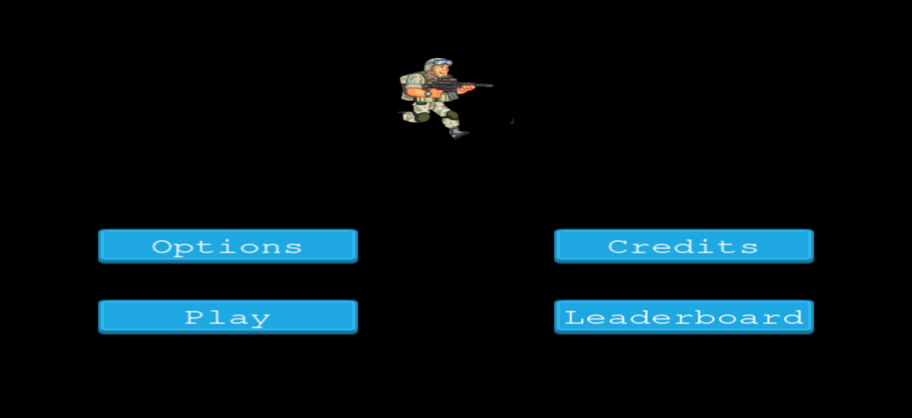
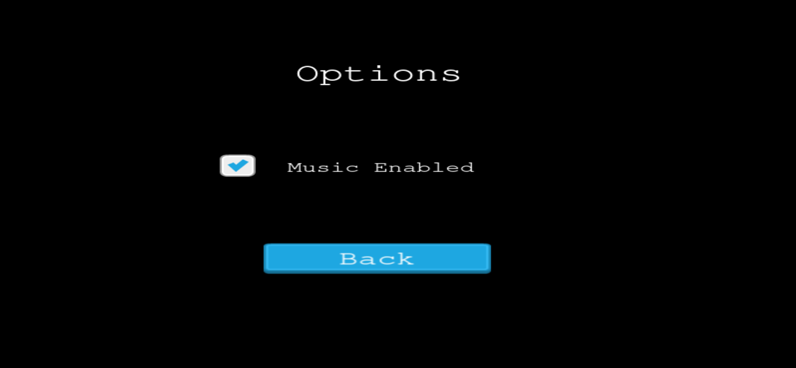
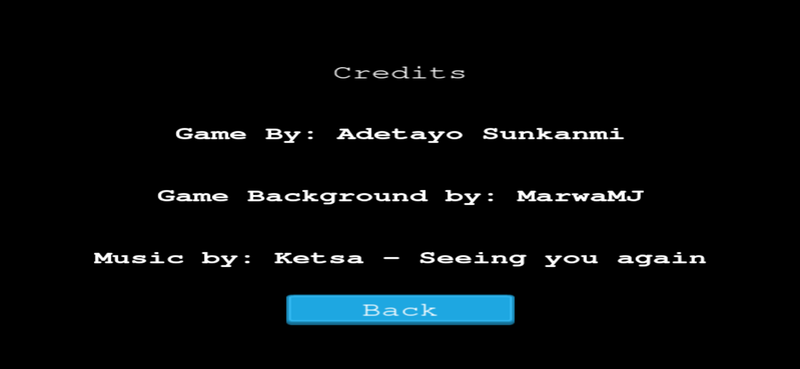
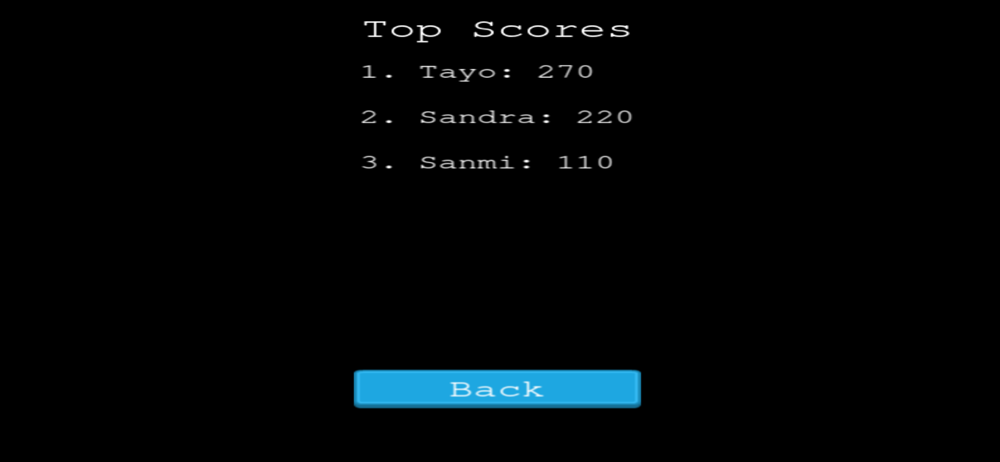
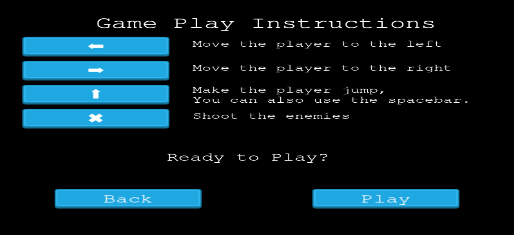
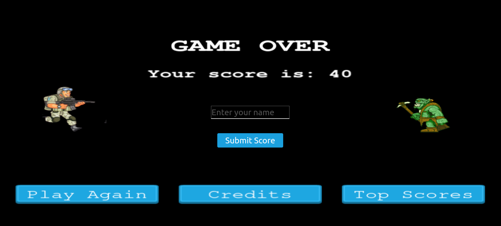

# Alien Chaser

<!--
*** Thanks for checking out this README Template. If you have a suggestion that would
*** make this better, please fork the repo and create a pull request or simply open
*** an issue with the tag "enhancement".
*** Thanks again! Now go create something AMAZING! :D
-->

<!-- PROJECT SHIELDS -->

  

  

    This project is my Microverse JavaScript module capstone assessment!
  

<!-- TABLE OF CONTENTS -->

## Table of Contents

- [About the Project](#about-the-project)
- [Contributors](#contributors)
- [Acknowledgements](#acknowledgements)
- [License](#license)

## About The Project

A browser-based shooter game built with Phaser3. The main character is a marine who gets attacked by some alien and their captured humans (monsters) trying to stop the marine from collecting coins. For every coin collected, you will get 10 points and in the end you can see how you compare to other players of the game.

When the game loads, you will be taken to a screen with 4 options:
* Play => this takes you to the screen with the instructions. After reading the instructions you can choose to go back to the main menu or to start the game
* Options => from here, you can enable or disable the music/sound.
* Credits => You can see the design details and contributions.
* Leaderboard => from here, you can see the users with the top scores and try to beat their scores.

## How It Works

You can use the following controls to play the game:
* ⬅️ - Press the left arrow key to move left.
* ➡️ - Press the right arrow key to move right
* ⬆️ - Press the up arrow key or the space bar to jump.
* X - Press the 'X' key to shoot the enemies.

## Game Play

### Loading Screen:

    

### Menu Screen:

    

### Disable/Enable Audio:

    

### Credits:

    

### Leaderboard:

    

### Instructions:

    

### Game Play:

    

### Game Over:

    

## LIVE DEMO
[Project live link](https://relaxed-easley-57a150.netlify.app/)

## Contributing
<!-- ABOUT THE PROJECT -->

## Getting Started
- To get a local copy up and running follow these simple steps.

#### Clone the repository to run the app.

- $ `git clone git@github.com:jstloyal/Alien-Chaser.git`
- `cd` into the project directory
- Run `npm install` to install the necessary modules
- Run `npm start` to automatically open the local server

### Built With

This project was built using these technologies.

- Javascript
- HTML
- CSS
- Webpack
- Leaderboard API service
- ESlint
- VSCode editor
- Git-Flow
- Jest
- npm
- ES6

<!--GAME DEVELOPMENT-->
## Game Development
### Day 0:
* On the first day, after requesting for my project, I spent the day reading the requirements and looking at tutorials. I then set up my repository, configured my webpack and gathered the character sprites, background and music that I would be using in my project. By the end of the day, I had a shell of the game I wanted to create.

### Day 1:
* The next day, my plan was to start the game logic, however I got stuck and needed to watch a few more tutorials about the game. By the end of the day, I felt I had a deeper understanding of how to approach the project.

### Weekend:
* Over the weekend, my intention was to do the game logic. I spent the day working on the game logic. I also completed the scores and implemented my API key for the leaderboards.

### Day 2:
* On the second day, I completed all of the other scenes (preloader, title, game over, etc.). Then, I worked on testing my project and deploying my project to netlify. By the end of day 2, I had a fully functional project that was ready to submit for a review. All that was left was to complete the README.

### Day 3:
* On the third day, I asked various friends and family members to play my game in order to make sure all of the features are working correctly. I then played the game myself in order to create a few gifs to add into my README.

### Day 4:
* On the afternoon of day 4,  I began writing my README documentation.I finished my README and prepared to submit my project for a review.

## Contributors

**Authors**

​**Adetayo Sunkanmi**

- Github: [@jstloyal](https://github.com/jstloyal)
- Twitter: [@jstloyalty](https://twitter.com/jstloyalty)
- Linkedin: [Adetayo Sunkanmi](https://www.linkedin.com/in/jstloyalty)
- E-mail: jstloyalty@gmail.com

<!-- ACKNOWLEDGEMENTS -->

## Acknowledgements

- [Microverse](https://www.microverse.org/)

## License

📝
This project is [MIT](https://opensource.org/licenses/MIT) licensed.
